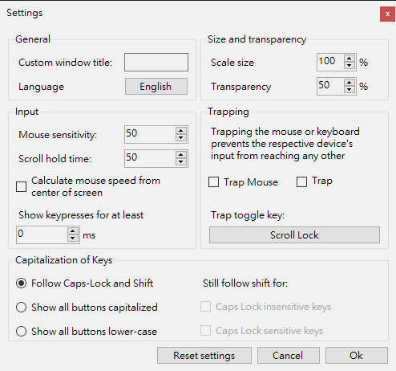

# NohBoard

NohBoard is a keyboard visualization program. I know certain applications already exist that do just this, display your keyboard on-screen. And even more probably. However, so far I have found none that were both free and easy to use. That's where this program came in, I made it to be free and easy to use, without any fancy graphics, and easily capturable (possibly with chroma key). Furthermore, it's very customizable.

## Screenshots

## Windows client

The **Windows** client uses **.NET 8** WinForms. The published executable is **`bm-nohboard.exe`**. This fork is a **separate product** from upstream [ThoNohT/NohBoard](https://github.com/ThoNohT/NohBoard): it does **not** read **`NohBoard.json`** or run **`NohBoard.exe`** for single-instance handoff. Legacy **`.kb`** keyboard files can still be imported from the load-keyboard dialog (**Load Legacy kb file...**). Only one instance runs at a time; a new launch is coordinated with app id **`bm-nohboard`** (global mutex, named pipe `\\.\pipe\bm-nohboard`, and related helpers in `Extra/SingleInstanceGuard.cs`). Runtime options are stored in **`bm-nohboard.json` next to the executable** (`Constants.SettingsFilePath`). The window can be minimized to the **system tray**, with a menu to show it, toggle **overlay lock**, open settings, follow the about link, or exit. Updates are checked against **[BoringMan314/bm-nohboard](https://github.com/BoringMan314/bm-nohboard/releases)** releases. The UI is available in **zh_TW**, **zh_CN**, **ja_JP**, and **en_US** from settings (cycle order **zh_TW** → **zh_CN** → **ja_JP** → **en_US**; default **zh_TW**). The default window title follows other **[B.M]** projects (not localized), e.g. **`[B.M] NohBoard V1.4.0 By. [B.M] 圓周率 3.14`**. **Keyboard scale**, **frame and fill transparency** (including the **Input Overlay** and **Tutorial** theme lines), and **overlay lock** adjust how the overlay looks and behaves. **Reset settings** restores the defaults for the options on the settings dialog and saves **bm-nohboard.json**. On the load-keyboard dialog, font download links open in the **default browser**, and **Restart** is there for when you have finished installing fonts. The interface does not use hover tooltips on controls. To build or publish, see [**Building**](#building).

## Rewrite

An initial version was made in C++, this originated from the desire to make something with graphics, and what I knew was [OBS](http://github.com/jp9000/OBS), now replaced by [OBS Studio](http://github.com/jp9000/obs-studio). That's why I started in the same spirit, using C++, and rendering with DirectX. However, having spent most of my time on C# during at least the last decade or so, I decided that I would be much more able to create awesome things in this language. That's when I re-started. Rather than using DirectX, I switched to GDI+, as we're Windows only (I'm sorry, but I just really don't use any other OS, and so far it is still the go-to OS for gaming). No really fancy graphics are required, no 3D is required. This also makes it easier to capture, as a simple window capture in OBS will do the trick now, rather than having to fiddle with game capture which might not work due to a game typically being run at the same time as NohBoard.

## Contributors

**Maintainer / original author**
- Eric "ThoNohT" Bataille (e.c.p.bataille@gmail.com) - Original author

**Contributors**
- Marius "Buttercak3" Becker - Various bugfixes
- Ivan "YaLTeR" Molodetskikh - Added the scroll counter *(NohBoard classic)*
- Michal Mitter - Added button outline *(NohBoard classic)*

**Keyboard layouts**
- BaronBargy
- Burning Fish
- Cloudwolf
- Daigtas
- Floatingthru
- HAJohnny
- Helixia
- joao7yt
- kernel1337
- Krazy
- layarion
- MCCrafterTV
- MtB1980
- TicTacFoe
- ToxicMirror
- WayZHC
- wingsltd
- zolia
- SirDifferential
- flyingmongoose
- JapanYoshi
- dchitra
- android272 (Tutorial keyboard and styles, from [PR #144](https://github.com/ThoNohT/NohBoard/pull/144))

If you want to contribute, either with code, with keyboard definitions or keyboard styles, feel free to fork this repository and provide your changes via a pull request, or other means of submitting your changes back to me.

## Building

The WinForms client targets **.NET 8** (**`net8.0-windows`**). Install the [.NET 8 SDK](https://dotnet.microsoft.com/download/dotnet/8.0) on Windows, open `NohBoard/NohBoard.sln`, and build as usual. From the repository root, `build_win10.bat` performs a self-contained publish into `dist/` (it expects `NohBoard/gotri.exe` for version-stamped generated sources). If `gotri.exe` is missing, MSBuild may still work when `SolutionDir` points at the `NohBoard/` folder so templates generate; see the batch file and `NohBoard.csproj` pre-build target. Checked-out source text is normalized to **CRLF** line endings for consistent Windows diffs.

Ship the published exe together with the **`keyboards\`** resource tree next to the program unless you use a custom layout.

## Changelog

Update notes for each release are on this repository’s **Releases** page.

## Full Documentation

See the [Wiki](https://github.com/ThoNohT/NohBoard/wiki) for full documentation.

## Donations

Donations are neither required nor requested. They are, however, always appreciated, and due to some demand, there now is the possibility to [donate](https://www.paypal.com/cgi-bin/webscr?cmd=_s-xclick&hosted_button_id=FFB9XFRWE5EK2).
Note that donations are to be made purely for appreciation of performed work, and not as a means of prioritizing or requesting future work. They will not in any way impact the speed or order in which features are implemented.

## License

NohBoard is licensed under the GPL version 2. The license agreement is attached in this repository and can be found [here](https://github.com/ThoNohT/NohBoard/blob/master/LICENSE).
